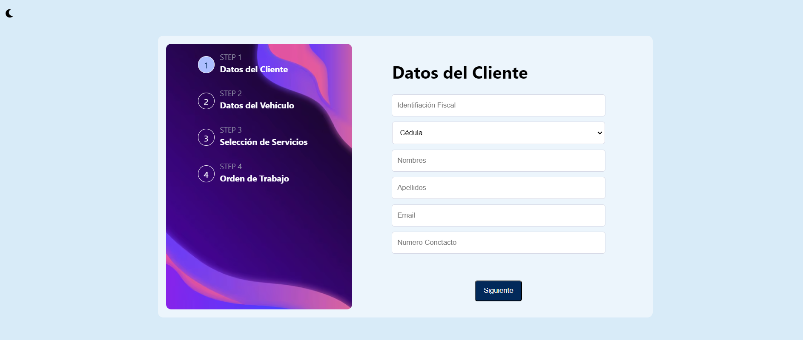
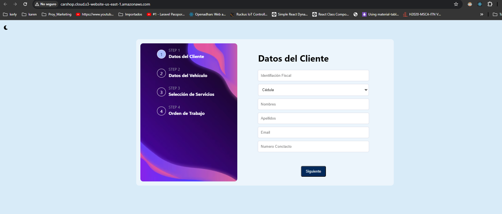

# car-shop
En esta solución, hemos desarrollado un formulario multi-step en React utilizando el contexto (AppContext) para gestionar el estado global de la aplicación. El formulario consta de varios pasos donde el usuario proporciona información sobre el cliente, el vehículo, los servicios que desea realizar y finalmente se muestra un resumen de la orden de trabajo.

### Desarrollo

Debemos tener Node.js y npm instalados en tu sistema.
Clona el repositorio del proyecto o crea una nueva aplicación React utilizando Create React App (npx create-react-app my-app).
Instala las dependencias necesarias:
```
bash
npm install 
```
Estructura del Proyecto:
```
my-app/
  src/
    components/
      Button.jsx
      Container.jsx
      MultiSelect.jsx
      Nav.jsx
      Step.jsx
    page/
      ClienteForm.jsx
      VehiculoForm.jsx
      ServiciosForm.jsx
      OrdenTrabajo.jsx
      FormularioMultiStep.jsx
    context/
      AppContext.js
    App.js
    index.js
    routes.js
  public/
    index.html
```


* components/: Contiene los componentes del formulario (ClienteForm.js, VehiculoForm.js, ServiciosForm.js, OrdenTrabajo.js).

* context/: Contiene el contexto de la aplicación (AppContext.js).

* App.js: Punto de entrada principal de la aplicación que configura las rutas y el contexto.
* index.js: Archivo de inicio de la aplicación React.

### Desarrollo de los Componentes:
Cada componente (ClienteForm, VehiculoForm, ServiciosForm, OrdenTrabajo) está diseñado para manejar un paso específico del formulario y se comunica con el contexto para almacenar los datos ingresados por el usuario.

Se utiliza el hook useAppContext para acceder al estado global y al dispatcher proporcionados por el contexto.

Rutas y Navegación:
Se utiliza React Router DOM para la navegación entre los diferentes pasos del formulario.
FormularioMultiStep.js controla la lógica de navegación y renderiza los componentes de paso correspondientes según el estado step.

### Despliegue

Para desplegar la aplicación utilizando Docker, sigue estos pasos:

```
npm run build
```
Luego estos archivos cargarlos a S#
La aplicación estará disponible en http://localhost:3000 en tu navegador.
### Vista Formulario Multi Step



### Despliegue AWS S3-CloutFront
#### Despliegu een S3 
Link generado por S3 , recordar que AWS academy una vez cerrado la sesion el servicio se apaga. 
http://carshop.cloud.s3-website-us-east-1.amazonaws.com/




### Referencia de Despligue
https://medium.com/@Anita-ihuman/deploying-a-react-app-using-aws-s3-and-cloud-front-c0950808bf03
